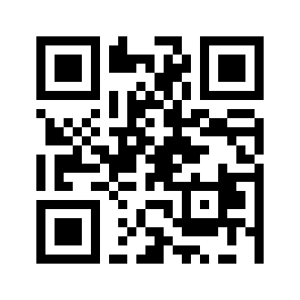

# **password-generator**


Password Generator CLI written in Python. Some of the more useful features include the ability to define your own character set, password length, and if you would like to save the generated password as a text file or QR Code.


## **Installing Requirements**
```bash
$ cd password-generator
$ poetry install
>> ...
```


## **Examples**
### **QR Code Generation**
```bash
$ cd password-generator
$ poetry run py app/main.py -qr ./output.bmp
>> ...
>> Saved generated password as a QR Code to './output.bmp'.
$ ./output.bmp
```



### **Finding Helpful Information**
Helpful information includes all flags you can pass through the application,
and descriptions of them and their parameters.
```bash
$ cd password-generator
$ poetry run py app/main.py -h
>> Password Generator ~ Help
>> ...
```